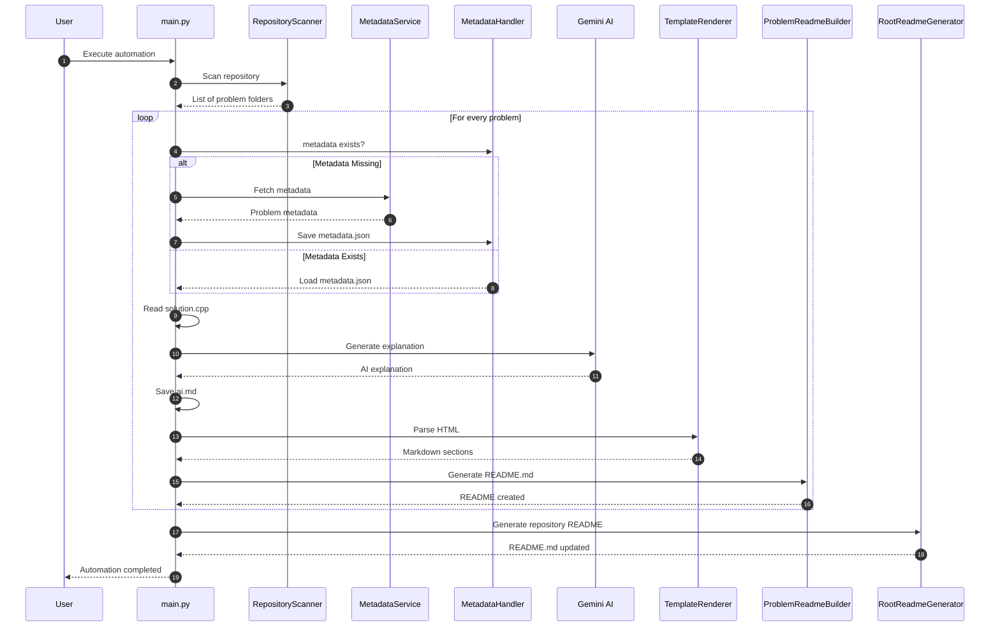
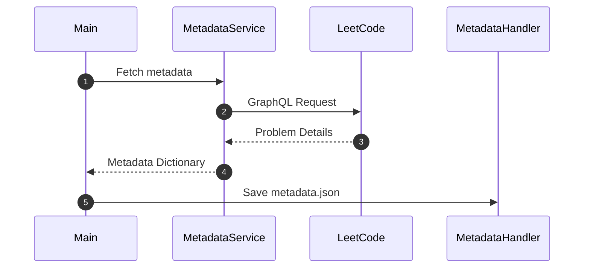
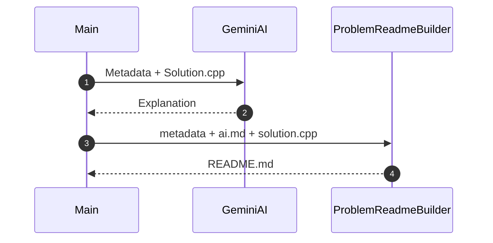
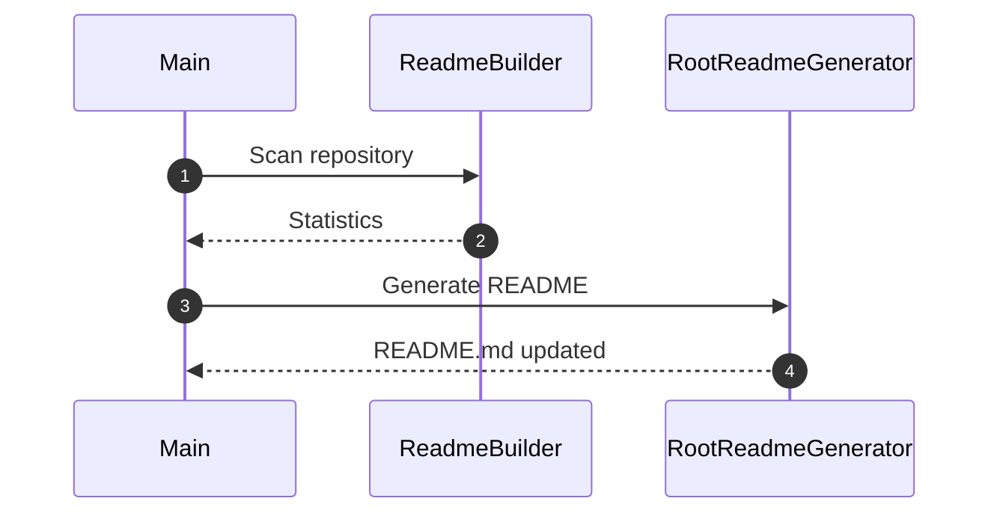
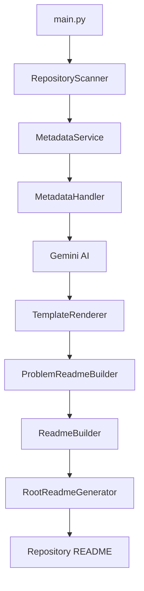
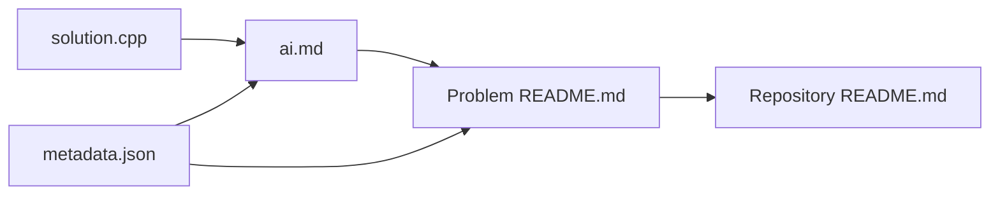
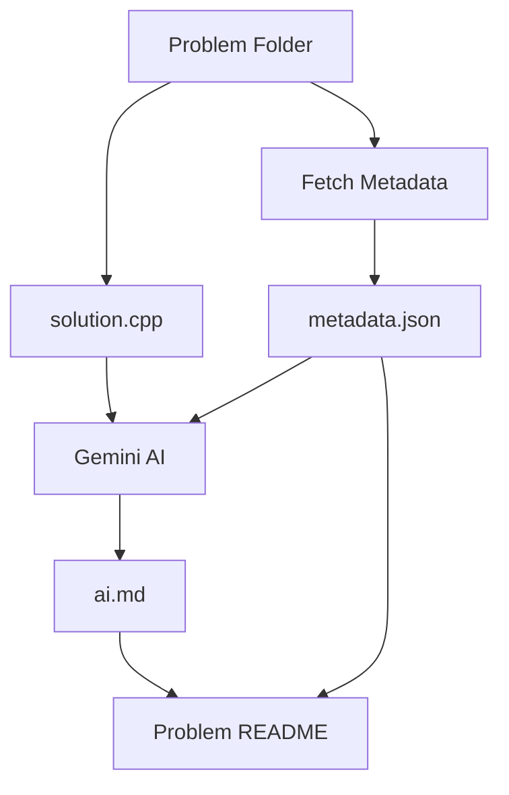
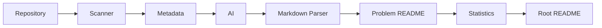

# 🔄 Sequence Diagram

## Overview

This document describes how different components of the AI-Powered LeetCode Documentation Generator interact during execution.

GitHub supports **Mermaid**, so the diagrams below render automatically in the repository.

---

# Complete System Sequence

---

# Metadata Generation

---

# AI Documentation Generation

---

# Repository README Generation

---

# Component Interaction

---

# File Generation Flow

---

# Folder Lifecycle

---

# Overall Pipeline

---

# Summary

The documentation pipeline consists of three major stages:

### Stage 1 — Data Collection

- Repository scanning
- Metadata retrieval
- Solution loading

### Stage 2 — Documentation Generation

- AI explanation generation
- HTML parsing
- README generation

### Stage 3 — Repository Dashboard

- Statistics computation
- Progress tracking
- Repository homepage generation

Each component performs a single responsibility, allowing the workflow to remain modular, maintainable, and easily extensible.